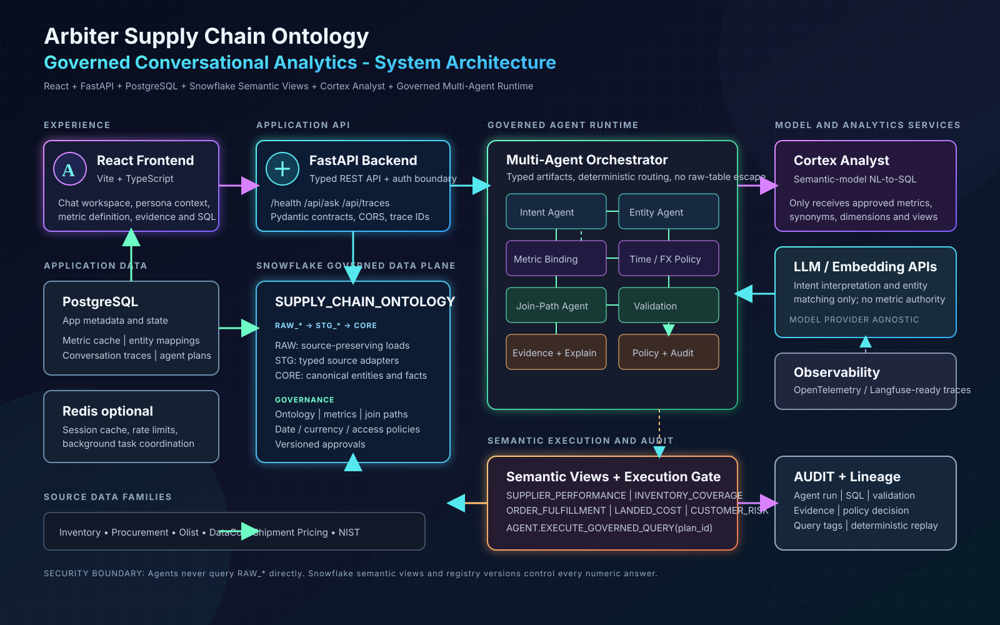
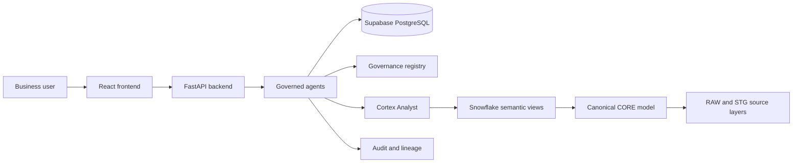

# Supply Chain Ontology and Governed Conversational Analytics



Supply-chain data is scattered across ERP, procurement, logistics, supplier, inventory, customer, and shipment systems. Different identifiers, dates, grains, currencies, and definitions mean that the same question can produce different answers across planning, procurement, and logistics.

Arbiter builds a governed supply-chain ontology and conversational analytics layer so business meaning, not raw column names, drives every answer.

```text
Supplier -> Part -> Plant / Warehouse -> Shipment -> Purchase Order
Part -> Inventory -> Customer Order -> Customer
```

## The Problem

Questions such as “What was our on-time delivery?” can have several valid definitions:

- Original supplier commitment versus dock arrival
- Revised commitment versus dock arrival
- Goods receipt versus original commitment
- On-time and complete delivery

The same ambiguity affects fill rate, days of inventory, landed cost, and supplier spend. A raw-table LLM can silently choose different formulas, dates, entities, or joins on different queries.

## The Solution

A governed conversational analytics platform where the metric definition is the executable artifact.

| Capability | Purpose |
|---|---|
| **Ontology** | Defines suppliers, parts, locations, shipments, orders, inventory, customers, costs, and relationships |
| **Governed metrics** | Registers formulas, grain, date policy, currency policy, steward, and version |
| **Semantic views** | Exposes business concepts through approved Snowflake views |
| **Entity resolution** | Maps source IDs such as `SUP-1001`, `SUP-1044`, and `VEND-88` to one canonical supplier |
| **Join governance** | Prevents fact-to-fact fan-out and uncontrolled raw-table joins |
| **Conversational analytics** | Lets every persona ask cross-domain questions in natural language |
| **Explainability** | Returns definition, SQL, join path, evidence, validation, and trace ID |
| **Refusal and clarification** | Refuses undefined metrics and asks for missing information |

## Governed Metrics

```text
otd_original_commit
otd_confirmed
otif
unit_fill_rate
line_fill_rate
order_fill_rate
doi_trailing_actual
doi_forward_forecast
doi_available_supply
landed_cost_full
supplier_spend
customer_supply_risk
```

Each metric declares its definition, grain, numerator, denominator, filters, event date, currency and unit rules, approved joins, steward, and registry version.

## Agent Workflow

```text
Question
  -> Intent
  -> Entity Resolution
  -> Metric Binding
  -> Time and Currency Policy
  -> Join-Path Selection
  -> Query Planning
  -> Validation
  -> Evidence and Explanation
  -> Policy and Audit
  -> EXECUTE / CLARIFY / REFUSE
```

Agents interpret, route, validate, and explain. They cannot redefine a metric, bypass semantic views, query raw tables, or merge entities without evidence.

## Technology Stack

```text
Frontend:       React + Vite + TypeScript
Backend:        FastAPI + Pydantic
App database:   Supabase PostgreSQL
Analytics:      Snowflake
Semantic layer: Snowflake Semantic Views
NL analytics:   Cortex Analyst and governed agent tools
Audit:          Trace IDs, query tags, validation, evidence, and lineage
```



The controlled execution boundary is:

```text
AGENT.EXECUTE_GOVERNED_QUERY(query_plan_id)
```

## Source Data

The project keeps six source families separate before conformance:

- Inventory and supply chain
- Procurement and supplier performance
- Olist e-commerce
- DataCo SMART
- Shipment pricing
- NIST purchasing

See [DATA_MANIFEST.md](DATA_MANIFEST.md) for source files, row counts, licenses, and limitations.

## Hackathon Demonstration

1. Planning, procurement, and logistics ask the same delivery question.
2. All personas resolve to the same enterprise metric.
3. Legitimate metric variants remain explicitly named.
4. Acme is consolidated across source identifiers.
5. Customer-risk analysis avoids join fan-out inflation.
6. Every answer includes its definition, SQL, evidence, validation, and trace ID.
7. An undefined request such as “supplier health score” is refused.
8. Five paraphrases produce the same governed result.

## Project Documents

- [Full technical README](README_FULL.md)
- [Implementation guide](README_IMPLEMENTATION.md)
- [High-level design diagram](supply-chain-high-level-design.excalidraw)
- [System architecture SVG](supply-chain-system-architecture.svg)
- [Detailed project context](context.md)
- [Dataset manifest](DATA_MANIFEST.md)
