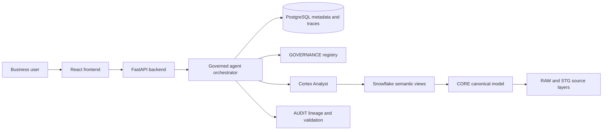

# Supply Chain Ontology and Governed Conversational Analytics

Supply chain data is scattered across ERP, logistics, supplier, inventory, customer, and shipment systems with inconsistent identifiers, event dates, grains, currencies, and business definitions. The same question can therefore produce different answers across planning, procurement, logistics, and finance, even when every query is technically correct.

Build an industry ontology and a governed conversational analytics layer that connects entities such as:

```text
Supplier -> Part -> Plant / Warehouse -> Shipment -> Purchase Order
Part -> Inventory -> Customer Order -> Customer
```

The ontology is expressed as governed Snowflake semantic views so business meaning, canonical metrics, approved relationships, and source lineage drive answers instead of raw column names.

## The Problem

The phrase "on-time delivery" can mean different things depending on the team:

- Arrival compared with the original supplier commitment
- Arrival compared with the revised supplier commitment
- Goods receipt compared with the original commitment
- On-time and complete delivery

The same ambiguity appears in other supply chain questions:

| Business question | Governed variants |
|---|---|
| On-time delivery | Original commitment, revised commitment, OTIF |
| Fill rate | Unit fill, line fill, order fill |
| Days of inventory | Trailing actual demand, forward forecast, available supply |
| Landed cost | Material, freight, duty, insurance, brokerage, FX policy |
| Largest supplier | Source ID, legal entity, DUNS, parent company |

A raw-table LLM must guess the metric formula, date field, entity identity, and join path every time. That produces inconsistent, unauditable answers and can create silent fan-out errors.

## The Solution

A governed conversational analytics platform where the metric definition is the executable artifact.

| Capability | What it does |
|---|---|
| **Supply chain ontology** | Defines entities, relationships, hierarchies, source identifiers, and business events |
| **Governed metrics** | Registers canonical formulas, grains, date policies, currency rules, and stewards |
| **Semantic views** | Exposes supplier, inventory, fulfillment, landed-cost, and customer-risk concepts |
| **Entity resolution** | Maps source identifiers such as supplier IDs, seller IDs, DUNS, and part numbers to canonical entities |
| **Join governance** | Allows only approved paths and prevents fact-to-fact fan-out |
| **Conversational analytics** | Lets planning, procurement, logistics, and other teams ask questions in natural language |
| **Explainability** | Returns the definition, filters, join path, evidence, SQL, validation, and trace ID |
| **Refusal and clarification** | Refuses undefined metrics and asks targeted questions when required inputs are missing |

## Canonical Metrics

The first governed metric families are:

```text
otd_original_commit
otd_confirmed
otif
unit_fill_rate
line_fill_rate
order_fill_rate
doi_trailing_actual
doi_forward_forecast
doi_available_supply
landed_cost_full
supplier_spend
customer_supply_risk
```

Every metric declares:

- Business definition
- Grain
- Numerator and denominator
- Population and exclusions
- Event and period policy
- Currency and unit policy
- Approved dimensions and join path
- Steward and registry version

## Governed Agent Workflow

```text
Natural-language question
        |
        v
Intent Agent
        |
        v
Ontology / Entity Resolution Agent
        |
        v
Metric Binding Agent
        |
        v
Time and Currency Policy Agent
        |
        v
Join-Path Agent
        |
        v
Query Agent
        |
        v
Validation Agent
        |
        +--> Clarification Agent when ambiguous
        |
        v
Evidence Agent -> Explanation Agent -> Policy and Audit Agent
        |
        v
Governed answer: EXECUTE / CLARIFY / REFUSE
```

Agents interpret, route, validate, and explain. They cannot silently redefine metrics, bypass semantic views, query raw tables, or merge entities without evidence.

## Technology Stack

```text
Frontend:       React + Vite + TypeScript
Backend:        FastAPI + Pydantic
Application DB: PostgreSQL
App database:   Supabase PostgreSQL
Analytics DB:   Snowflake
Semantic layer: Snowflake Semantic Views
NL analytics:   Cortex Analyst and governed agent tools
Observability:  Trace IDs, query tags, lineage, validation, and audit records
Deployment:     Docker-ready local services with Snowflake deployment scripts
```

### System flow



The production query boundary is:

```text
AGENT.EXECUTE_GOVERNED_QUERY(query_plan_id)
```

Only approved metrics, entities, policies, semantic views, and join paths can reach execution.

## Snowflake Data Architecture

```text
SUPPLY_CHAIN_ONTOLOGY
├── RAW_INVENTORY
├── RAW_PROCUREMENT
├── RAW_OLIST
├── RAW_DATACO
├── RAW_SHIPMENT_PRICING
├── RAW_NIST
├── STG_* source-specific adapters
├── CORE canonical entities and facts
├── GOVERNANCE ontology and metric registries
├── SEMANTIC business-facing views
├── AGENT typed plans and execution procedures
└── AUDIT query, lineage, validation, and policy records
```

Snowflake is the governed analytics and semantic execution plane. Supabase PostgreSQL stores application metadata, workflow state, entity-review state, and conversation traces.

## Source Data

The project profiles six source families and keeps them separate before conformance:

- Inventory and supply chain: suppliers, products, warehouses, purchase orders, receipts, balances, and movements
- Procurement and supplier performance: supplier risk, spend, contracts, delivery, savings, and ESG fields
- Olist e-commerce: customers, orders, order lines, sellers, products, payments, freight, and delivery dates
- DataCo SMART: customer orders, order items, products, shipping modes, delivery status, sales, profit, and clickstream
- Shipment pricing: delivery history, quantities, freight, insurance, unit price, and manufacturing site
- NIST purchasing: supplier, product, project, BOM, revision, and procurement hierarchies

See [DATA_MANIFEST.md](DATA_MANIFEST.md) for source files, row counts, licenses, and limitations.

## Demonstration

The hackathon demo proves:

1. Planning, procurement, and logistics ask the same delivery question.
2. All personas resolve to the same enterprise metric.
3. Legitimate variants such as OTD, confirmed OTD, and OTIF remain visible and named.
4. Acme is consolidated across source supplier identifiers.
5. Customer-risk analysis avoids shipment-to-order fan-out inflation.
6. Every answer shows its definition, SQL, join path, evidence, and validation.
7. An undefined request such as “supplier health score” is refused.
8. Five paraphrases of the same governed question produce the same result.

## Judging Focus

- **Real-world relevance:** Resolves a genuine cross-functional supply-chain governance problem.
- **Technical execution:** Uses a canonical ontology, Snowflake semantic views, typed agents, approved join paths, validation, and auditability.
- **Solution completeness:** Covers source data, entity resolution, metrics, conversational interaction, security, evidence, refusal, clarification, and deterministic replay.

## Project Documents

- [Full original technical README](README_FULL.md)
- [Implementation guide and local runbook](README_IMPLEMENTATION.md)
- [System architecture image](supply-chain-system-architecture.svg)
- [High-level design diagram](supply-chain-high-level-design.excalidraw)
- [Low-level design diagram](supply-chain-low-level-design.excalidraw)
- [Detailed project context](context.md)
- [Problem definition and agent model](PD.md)
- [Hackathon pitch and demo script](pitch.md)
- [Dataset manifest](DATA_MANIFEST.md)
