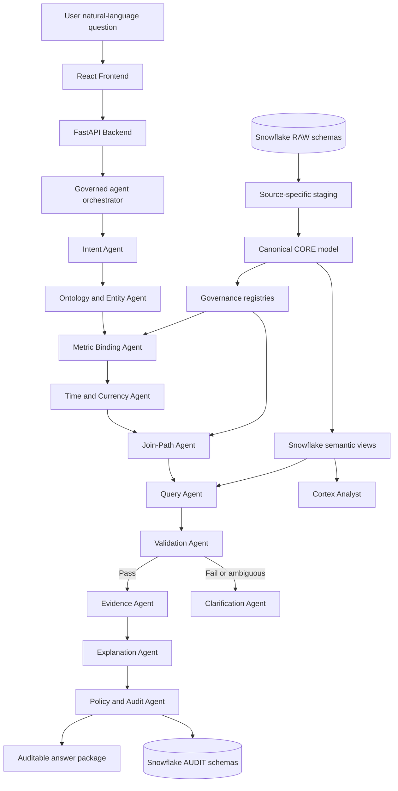
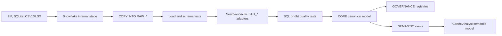
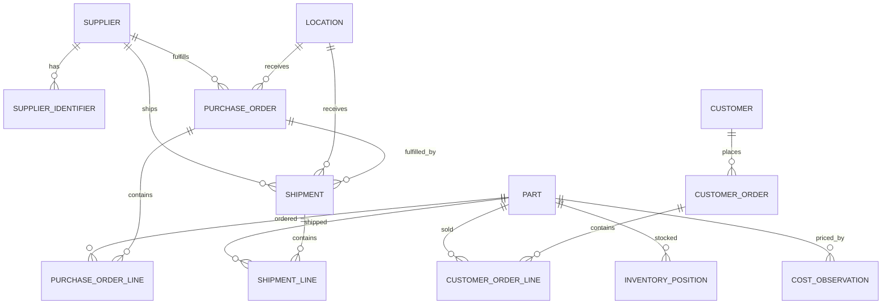
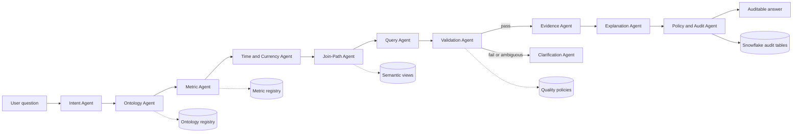
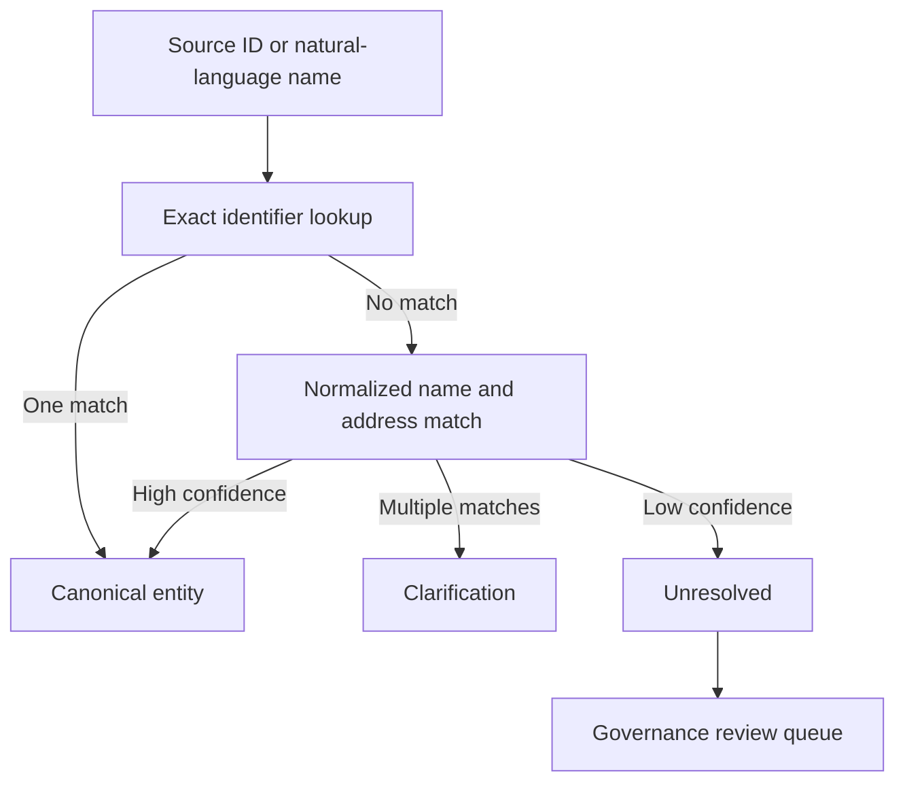

# Supply Chain Ontology and Governed Conversational Analytics

**Working name:** Arbiter  
**Hackathon:** AI-Native Data Applications on Snowflake  
**Domain:** Supply chain, procurement, inventory, logistics, supplier performance, and customer fulfillment  
**Platform:** React, FastAPI, PostgreSQL, Snowflake Semantic Views, Cortex Analyst, and governed agent skills

## 1. Executive Summary

Supply chain data is distributed across ERP, procurement, logistics, supplier, inventory, e-commerce, and shipment systems. Each source uses different identifiers, event dates, grains, currencies, and definitions. As a result, different teams can ask the same question and receive different numbers even when every SQL query is technically correct.

This project builds a governed supply chain ontology and conversational analytics layer on Snowflake. The system represents business entities and relationships such as:

```text
Supplier -> Part -> Plant/Warehouse -> Shipment -> Purchase Order
Part -> Inventory -> Customer Order -> Customer
```

Natural-language agents interpret a question, resolve the entities, bind the request to a registered metric, select an approved join path, and execute read-only queries against Snowflake semantic views. Agents cannot invent formulas or bypass governance.

The product is intentionally designed to do three things:

1. Return one consistent enterprise answer for a defined metric.
2. Surface legitimate variants as named governed metrics.
3. Clarify or refuse questions that are ambiguous, undefined, unsupported, or unsafe.

> The definition is the executable artifact.

## 2. Problem Statement

The same operational event can have several valid observations:

- Original supplier promise date
- Revised supplier promise date
- Physical dock arrival
- Goods-receipt posting date
- Delivery recorded date

Without an ontology and metric registry, the phrase "on-time delivery" does not identify which dates, quantities, grain, or period policy should be used.

The same issue appears in other questions:

| Question | Possible definitions |
|---|---|
| On-time delivery | Original promise, revised promise, dock arrival, goods receipt, quantity complete |
| Fill rate | Unit fill, line fill, order fill |
| Days of inventory | On-hand over trailing consumption, forward forecast, available supply |
| Landed cost | Material only, material plus freight, full cost with duty, insurance, and brokerage |
| Largest supplier | Source supplier ID, legal entity, DUNS, parent company |

A raw-table LLM makes this problem worse. It must guess the metric, date, join path, and entity identity on every query. The same user can receive different answers across sessions.

## 3. Goals and Scope

### In scope

- Supply chain ontology and business entity model
- Supplier, part, product, plant, warehouse, shipment, purchase order, customer, and inventory concepts
- Canonical identities and source-system crosswalks
- Explicit event types and source claims
- Governed semantic views
- Canonical metric registry
- Natural-language conversational analytics
- Entity resolution
- Time, currency, and unit policies
- Join-path governance and fan-out protection
- Validation, lineage, evidence, and audit trails
- Snowflake implementation and React/FastAPI demonstration
- Multi-persona consistency demonstration

### Out of scope

- Live ERP connectivity
- Master-data stewardship workflow
- ML forecasting
- Write-back to ERP or source systems
- Automated approval of new metrics or entity mappings
- Replacing source systems

## 4. Acceptance Criteria

The solution is successful when:

1. Planning, procurement, and logistics ask the same business question and receive the same enterprise metric.
2. Legitimate variants such as `otd_confirmed` and `otif` remain available as explicitly named metrics.
3. Acme is consolidated across all approved supplier identifiers.
4. Cross-domain questions do not inflate measures through fact-to-fact fan-out.
5. Every answer includes its definition, filters, join path, evidence, SQL, and registry versions.
6. Undefined metrics produce a refusal instead of an invented number.
7. Missing parameters produce a targeted clarification question.
8. Repeating or paraphrasing a question produces a deterministic result when registry versions are unchanged.
9. A disagreement between source observations is shown as governed divergence, not silently overwritten.
10. Proposed changes enter an approval process before affecting production answers.

## 5. Source Data Landscape

Raw sources remain separate. They are adapted into the canonical model only after source-specific profiling and quality checks. See [DATA_MANIFEST.md](DATA_MANIFEST.md) for the source registry and licensing notes.

### Inventory and Supply Chain

Source folder: `supply-chain-data/inventory-supply-chain/`

| Table | Rows | Grain |
|---|---:|---|
| `suppliers` | 250 | One row per supplier |
| `products` | 2,500 | One row per product |
| `warehouses` | 12 | One row per warehouse |
| `inventory_opening_balances` | 30,000 | Product x warehouse opening balance |
| `purchase_orders` | 18,000 | One row per purchase order |
| `purchase_order_lines` | 53,967 | One row per PO line |
| `inventory_movements` | 138,436 | Product x warehouse x inventory event |

Primary use: inbound procurement, supplier performance, purchase orders, inventory movement, and stock coverage.

### Purchase Orders and Supplier Performance

Source folder: `supply-chain-data/procurement-supplier-performance/`

The workbook contains:

| Sheet | Rows | Grain |
|---|---:|---|
| Procurement transactions | 5,200 | Procurement transaction or PO line |
| Calendar | 1,095 | One row per date |
| Data dictionary | 87 | Field vocabulary |

Important fields include supplier identity, supplier risk, supplier tier, item code, category, quantity, unit price, discounts, tax, currency, requested delivery, actual delivery, days late, on-time delivery, contracts, payment status, maverick spend, single-source flag, and ESG score.

### Olist Brazilian E-Commerce

Source folder: `supply-chain-data/olist-ecommerce/`

| Table | Rows |
|---|---:|
| `olist_customers_dataset` | 99,441 |
| `olist_geolocation_dataset` | 1,000,163 |
| `olist_order_items_dataset` | 112,650 |
| `olist_order_payments_dataset` | 103,886 |
| `olist_order_reviews_dataset` | 104,719 |
| `olist_orders_dataset` | 99,441 |
| `olist_products_dataset` | 32,951 |
| `olist_sellers_dataset` | 3,095 |
| `product_category_name_translation` | 71 |

Primary use: customer orders, order lines, sellers, products, delivery dates, payments, freight, and reviews.

### DataCo SMART Supply Chain

Source folder: `supply-chain-data/dataco-supply-chain/`

| Table | Rows | Grain |
|---|---:|---|
| `DataCoSupplyChainDataset.csv` | 180,519 | Denormalized order-item record |
| `tokenized_access_logs.csv` | 469,977 | Product or category access event |
| `DescriptionDataCoSupplyChain.csv` | 52 | Field dictionary |

The main DataCo table must be treated as an order-item fact, not an order-level fact. Order-level measures must be pre-aggregated before joining to other facts.

### Shipment Pricing

Source folder: `supply-chain-data/shipment-pricing/`

| Table | Rows | Grain |
|---|---:|---|
| `SCMS_Delivery_History_Dataset_20150929.csv` | 10,324 | Shipment or delivery-history line |

Primary use: scheduled and actual delivery, shipment mode, freight cost, insurance, unit price, line value, quantity, and manufacturing site.

### NIST Purchasing

Source folder: `supply-chain-data/nist-purchasing/`

This archive contains multiple sample domains for suppliers, products, projects, BOMs, revisions, procurement types, manufacturer part numbers, vendor part numbers, and supplier details. It is primarily useful for demonstrating product, supplier, and project hierarchies.

## 6. High-Level Architecture




The critical control is that the chat interface and agents do not have a raw-table escape hatch. The final query must reference an approved semantic view and an active metric definition.

## 7. Snowflake Architecture

Snowflake is the data, semantic, security, and execution plane for the application. The agent layer interprets and routes requests, but Snowflake stores and enforces the governed artifacts.

### 7.1 Database and schema layout

```text
SUPPLY_CHAIN_ONTOLOGY
├── RAW_INVENTORY
├── RAW_PROCUREMENT
├── RAW_OLIST
├── RAW_DATACO
├── RAW_SHIPMENT_PRICING
├── RAW_NIST
├── STG_INVENTORY
├── STG_PROCUREMENT
├── STG_OLIST
├── STG_DATACO
├── STG_SHIPMENT_PRICING
├── STG_NIST
├── CORE
├── GOVERNANCE
├── SEMANTIC
├── AGENT
└── AUDIT
```

| Schema | Responsibility | Agent access |
|---|---|---|
| `RAW_*` | Immutable source loads and original metadata | None |
| `STG_*` | Source-specific typing, cleanup, and deduplication | None |
| `CORE` | Canonical entities, facts, events, and crosswalks | Through approved views |
| `GOVERNANCE` | Ontology, metric, policy, and join-path registries | Read-only |
| `SEMANTIC` | Business-oriented semantic views | Approved query target |
| `AGENT` | Typed plans, run state, and tool artifacts | Orchestrator only |
| `AUDIT` | Query, lineage, validation, and policy evidence | Append-only for app |

### 7.2 Ingestion and transformation



Each raw record should carry:

```text
source_system
source_file
source_dataset_version
source_row_number
record_hash
ingested_at
load_batch_id
```

The current static archive files can use repeatable batch loading. Snowflake Streams and Tasks can be added later for incremental processing.

### 7.3 Snowflake objects

Canonical objects:

```text
CORE.SUPPLIER
CORE.SUPPLIER_IDENTIFIER
CORE.PART
CORE.PART_IDENTIFIER
CORE.LOCATION
CORE.CUSTOMER
CORE.PURCHASE_ORDER
CORE.PURCHASE_ORDER_LINE
CORE.SHIPMENT
CORE.SHIPMENT_EVENT
CORE.CUSTOMER_ORDER
CORE.CUSTOMER_ORDER_LINE
CORE.INVENTORY_MOVEMENT
CORE.INVENTORY_POSITION
CORE.COST_OBSERVATION
CORE.SOURCE_CLAIM
```

Governance objects:

```text
GOVERNANCE.ONTOLOGY_ENTITY
GOVERNANCE.ENTITY_IDENTIFIER_MAP
GOVERNANCE.METRIC_REGISTRY
GOVERNANCE.METRIC_COMPONENT
GOVERNANCE.JOIN_PATH_REGISTRY
GOVERNANCE.DATE_POLICY
GOVERNANCE.CURRENCY_POLICY
GOVERNANCE.ACCESS_POLICY
GOVERNANCE.ONTOLOGY_VERSION
```

Semantic objects:

```text
SEMANTIC.SUPPLIER_PERFORMANCE
SEMANTIC.INVENTORY_COVERAGE
SEMANTIC.ORDER_FULFILLMENT
SEMANTIC.LANDED_COST
SEMANTIC.CUSTOMER_SUPPLY_RISK
```

Each semantic object declares its grain, dimensions, measures, relationships, synonyms, source authority, and approved join paths.

### 7.4 Cortex Analyst

Cortex Analyst receives the semantic model, business vocabulary, synonyms, relationships, and metric metadata. It does not receive the raw six-source schema as its primary interface.

```text
React frontend + FastAPI backend
  -> Agent orchestrator
  -> Intent and entity tools
  -> Metric registry gate
  -> Cortex Analyst or approved SQL plan
  -> Snowflake semantic view
  -> Validation SQL
  -> Answer package
```

Cortex Analyst can translate an approved intent into SQL, but the application must inspect the query before execution. Queries that reference `RAW_*`, unapproved `CORE` tables, or unregistered joins are rejected.

### 7.5 React frontend and FastAPI backend

The React application should display, using the FastAPI API:

```text
Result
Metric ID and definition
Applied period and date policy
Canonical entity and source identifiers
Approved join path
Validation status
Evidence records
Generated SQL
Trace ID and registry versions
```

The UI has three deliberate states:

```text
EXECUTE   Governed query ran and validation passed
CLARIFY   A required metric, entity, time, or currency input is missing
REFUSE    No governed metric or approved join path exists
```

### 7.6 Security and governance

Recommended roles:

```text
ROLE_INGEST_SERVICE       -> RAW_* write
ROLE_TRANSFORM_SERVICE    -> STG_* and CORE write
ROLE_GOVERNANCE_STEWARD   -> GOVERNANCE approval
ROLE_AGENT_READ           -> SEMANTIC read, AGENT append, AUDIT append
ROLE_APPLICATION          -> Semantic read and controlled procedure execute
ROLE_AUDITOR              -> Audit and lineage read
```

The application role must not have general raw-table access or source write access. Add row-access and masking policies when user-level or supplier-sensitive data is exposed.

Query tags should include:

```text
trace_id
conversation_id
persona
metric_id
ontology_version
semantic_view_version
```

## 8. Canonical Ontology

### 8.1 Entity relationship model



### 8.2 Supplier

```text
SUPPLIER
--------
canonical_supplier_id
legal_name
parent_supplier_id
duns_number
country_code
supplier_status
supplier_tier
default_currency
source_authority
effective_from
effective_to
```

```text
SUPPLIER_IDENTIFIER
-------------------
identifier_id
canonical_supplier_id
source_system
source_supplier_id
identifier_type
identifier_value
match_method
match_confidence
approved_by
```

A supplier may appear under several source identifiers. For example, `SUP-1001`, `SUP-1044`, `VEND-88`, and a DUNS number may resolve to one canonical supplier only when the crosswalk has approved evidence.

### 8.3 Part and product

A canonical part is separate from a source product record.

```text
PART
----
canonical_part_id
part_number
description
commodity
category
sub_category
unit_of_measure
standard_cost
active_flag
```

NIST product and BOM data can extend the hierarchy:

```text
Part -> BOM Component -> Parent Part
Part -> Project
Part -> Commodity -> Category
```

### 8.4 Location

Warehouses and plants should not be silently treated as identical.

```text
LOCATION
--------
canonical_location_id
location_type
location_name
region
country
capacity_units
```

Allowed location types include `PLANT`, `WAREHOUSE`, `CUSTOMER_DESTINATION`, `SUPPLIER_SITE`, and `MANUFACTURING_SITE`.

### 8.5 Shipment and events

```text
SHIPMENT
--------
canonical_shipment_id
source_system
source_shipment_id
purchase_order_id
supplier_id
origin_location_id
destination_location_id
shipment_mode
incoterm
status
```

```text
SHIPMENT_EVENT
--------------
shipment_event_id
canonical_shipment_id
event_type
event_timestamp
source_system
source_record_id
source_authority
```

Event types include:

```text
PROMISE_ORIGINAL
PROMISE_REVISED
PO_SENT
ASN_RECEIVED
SHIPMENT_DISPATCHED
DOCK_ARRIVAL
DELIVERED_TO_CLIENT
GOODS_RECEIPT_POSTED
DELIVERY_RECORDED
```

### 8.6 Orders and customers

Inbound and outbound orders are separate domains.

```text
PURCHASE_ORDER
--------------
purchase_order_id
supplier_id
receiving_location_id
ordered_at
expected_at
received_at
status
currency
```

```text
PURCHASE_ORDER_LINE
-------------------
purchase_order_line_id
purchase_order_id
part_id
quantity_ordered
quantity_received
unit_cost
```

```text
CUSTOMER_ORDER
--------------
customer_order_id
customer_id
order_date
status
estimated_delivery_date
delivered_date
```

```text
CUSTOMER_ORDER_LINE
-------------------
customer_order_line_id
customer_order_id
part_id
quantity_ordered
quantity_shipped
unit_price
freight_amount
```

Inbound and outbound facts should only be connected through an approved inventory, allocation, or demand relationship.

### 8.7 Inventory and cost

```text
INVENTORY_MOVEMENT
------------------
movement_id
part_id
location_id
movement_at
movement_type
quantity_change
purchase_order_line_id
transfer_id
```

```text
INVENTORY_POSITION
------------------
part_id
location_id
as_of_date
opening_units
receipt_units
sale_units
adjustment_units
transfer_in_units
transfer_out_units
closing_units
quality_inspection_units
in_transit_units
```

```text
COST_OBSERVATION
----------------
cost_id
source_system
source_record_id
purchase_order_id
shipment_id
part_id
cost_type
amount
currency
quantity_basis
incurred_at
fx_rate
fx_rate_date
```

Cost types include `MATERIAL`, `FREIGHT`, `DUTY`, `INSURANCE`, `CUSTOMS_BROKERAGE`, `HANDLING`, `TAX`, and `DISCOUNT`.

## 9. Governed Metrics

All metrics live in `GOVERNANCE.METRIC_REGISTRY` and are exposed through semantic views. A metric definition must declare:

- Business definition
- Metric grain
- Numerator
- Denominator
- Population filter
- Date and event policy
- Currency policy
- Unit-of-measure policy
- Allowed dimensions
- Approved join path
- Steward
- Version and status

### 9.1 On-time delivery

Recommended enterprise metric:

```text
otd_original_commit
```

Example definition:

```text
grain: shipment line
promise event: PROMISE_ORIGINAL
delivery event: DOCK_ARRIVAL
quantity rule: any positive quantity received
period rule: DOCK_ARRIVAL date
numerator: eligible deliveries where arrival <= original promise
denominator: eligible deliveries with promise and arrival
```

Named siblings:

```text
otd_confirmed
otif
otd_gr_posted
```

The system must never silently switch between these definitions.

### 9.2 Fill rate

```text
unit_fill_rate = SUM(quantity_shipped) / SUM(quantity_ordered)

line_fill_rate =
  COUNT(lines where quantity_shipped >= quantity_ordered)
  / COUNT(eligible lines)

order_fill_rate =
  COUNT(orders where every eligible line is complete)
  / COUNT(eligible orders)
```

When a user asks for “fill rate” without specifying the variant, the Metric Agent asks for clarification.

### 9.3 Days of inventory

```text
doi_trailing_actual = on_hand_units / average_daily_actual_consumption

doi_forward_forecast = on_hand_units / average_daily_forecast_demand

doi_available_supply =
  (on_hand_units + quality_inspection_units + in_transit_units)
  / average_daily_forecast_demand
```

Each metric explicitly declares what counts as inventory and which demand basis is used.

### 9.4 Landed cost

```text
landed_cost =
  material
  + freight
  + duty
  + insurance
  + customs_brokerage
  + approved handling costs
  - applicable discounts
```

The metric must declare tax treatment, FX-rate date, incoterm handling, quantity denominator, and currency normalization.

### 9.5 Additional metrics

The registry can also contain:

```text
supplier_spend
supplier_spend_share
supplier_concentration
supplier_risk_index
supplier_savings
maverick_spend_rate
single_source_exposure
customer_supply_risk
```

## 10. Semantic Views

### Supplier performance

```text
SEMANTIC.SUPPLIER_PERFORMANCE
--------------------------------
canonical_supplier_id
supplier_name
period_date
period_year
period_quarter
shipments_eligible
shipments_on_time
shipments_complete
otd_original_commit
otd_confirmed
otif
quantity_ordered
quantity_received
unit_fill_rate
spend_amount
spend_currency
supplier_risk
supplier_esg_score
```

### Inventory coverage

```text
SEMANTIC.INVENTORY_COVERAGE
---------------------------
canonical_part_id
canonical_location_id
as_of_date
on_hand_units
quality_inspection_units
in_transit_units
trailing_daily_consumption
forward_daily_forecast
doi_trailing_actual
doi_forward_forecast
doi_available_supply
reorder_point
stockout_flag
```

### Order fulfillment

```text
SEMANTIC.ORDER_FULFILLMENT
--------------------------
customer_order_id
customer_id
canonical_part_id
order_date
quantity_ordered
quantity_shipped
line_fill_flag
order_fill_flag
estimated_delivery_date
actual_delivery_date
delivery_status
freight_amount
```

### Landed cost

```text
SEMANTIC.LANDED_COST
--------------------
purchase_order_id
shipment_id
canonical_supplier_id
canonical_part_id
quantity
material_cost
freight_cost
duty_cost
insurance_cost
brokerage_cost
discount_amount
currency
fx_rate
fx_rate_date
landed_cost_amount
landed_cost_per_unit
```

### Customer supply risk

```text
SEMANTIC.CUSTOMER_SUPPLY_RISK
-----------------------------
customer_id
customer_order_id
canonical_part_id
supplier_id
purchase_order_id
shipment_id
quantity_ordered
quantity_shipped
late_delivery_flag
incomplete_delivery_flag
customer_exposure_units
```

This view must be built from pre-aggregated facts and approved allocation paths. It must not directly join shipment lines, purchase-order lines, customer-order lines, and clickstream events together.

## 11. Agent Architecture

Agents are responsible for interpretation, routing, validation, and explanation. They are not the source of truth for business definitions.

### Agent responsibilities

| Agent | Responsibility | Output | Must not do |
|---|---|---|---|
| Intent Agent | Interpret question, persona, period, and requested entities | `QuestionIntent` | Invent metric or filter |
| Ontology Agent | Resolve names and source IDs to canonical entities | `ResolvedEntity` | Merge without evidence |
| Metric Agent | Bind intent to a registered metric | `MetricSelection` | Create a formula at runtime |
| Time and Currency Agent | Resolve period, event date, UOM, and FX policy | `TimePolicy`, `CurrencyPolicy` | Choose silently |
| Join-Path Agent | Select an approved semantic path | `JoinPlan` | Join raw facts directly |
| Query Agent | Compile read-only SQL against semantic views | `QueryPlan` | Query uncontrolled raw tables |
| Validation Agent | Check grain, duplicates, fan-out, and invariants | `ValidationReport` | Return failed results |
| Evidence Agent | Assemble source evidence and lineage | `EvidenceBundle` | Hide source disagreement |
| Explanation Agent | Present definition, result, assumptions, and SQL | `AnswerPackage` | Present unqualified numbers |
| Clarification Agent | Ask targeted questions | Clarification response | Guess user intent |
| Reconciliation Agent | Compare source observations and classify divergence | Reconciliation record | Overwrite source claims |
| Policy and Audit Agent | Enforce access, tools, provenance, and traceability | Audit decision | Override policy locally |

### End-to-end flow



### Shared execution envelope

Every agent call carries:

```text
trace_id
conversation_id
user_id
persona
question
ontology_version
metric_registry_version
semantic_view_version
policy_version
input_artifact_ids
output_artifact_ids
confidence
decision_status
reason_codes
```

Typed artifacts are stored in Snowflake:

```text
AGENT.QUESTION_INTENT
AGENT.RESOLVED_ENTITY
AGENT.METRIC_SELECTION
AGENT.JOIN_PLAN
AGENT.QUERY_PLAN
AGENT.VALIDATION_REPORT
AGENT.EVIDENCE_BUNDLE
AGENT.ANSWER_PACKAGE
AUDIT.AGENT_RUN
AUDIT.QUERY_EXECUTION
AUDIT.POLICY_DECISION
```

## 12. Entity Resolution and Source Reconciliation

### Entity resolution



The output includes the canonical ID, contributing source IDs, match method, confidence, and approval status.

### Source claims

Different source systems may provide different observations for the same business situation. Preserve them as claims:

```text
source_system
source_record_id
canonical_entity_id
event_type
observed_value
observed_at
effective_at
source_authority
reconciliation_status
```

Possible outcomes:

```text
CONFORMED
PREFERRED
RECONCILED
DIVERGENT
UNRECONCILED
```

For example, dock arrival and goods-receipt posting are different events. They should remain separate even when a metric chooses one of them.

## 13. Agent-to-Snowflake Execution Contract

The Query Agent receives only a typed plan:

```text
metric_id
canonical_entity_ids
time_range
dimensions
filters
approved_join_path_id
semantic_view_name
```

It cannot redefine:

```text
numerator
denominator
date_policy
currency_policy
uom_policy
```

The final execution gate should be a controlled Snowflake procedure or service endpoint:

```text
AGENT.EXECUTE_GOVERNED_QUERY(query_plan_id)
```

The procedure:

1. Verifies the active metric registry version.
2. Verifies that entities resolved successfully.
3. Verifies the join path is approved.
4. Retrieves SQL for the named semantic view.
5. Applies date, currency, and unit policies.
6. Runs validation queries.
7. Writes query, validation, lineage, and policy records to `AUDIT`.
8. Returns a result only when validation passes.

## 14. Validation and Guardrails

Required checks include:

```text
No duplicate keys at declared grain
No uncontrolled fact-to-fact fan-out
Required fields are not null
quantity_received <= quantity_ordered where applicable
on_time_shipments <= eligible_shipments
fill_rate between 0 and 1
OTD between 0 and 1
landed_cost_per_unit >= 0
Currency is known or an approved conversion exists
Date range matches the metric date policy
All entities resolve to canonical IDs
```

Guardrails:

1. Metric definitions, hierarchies, date policies, FX policies, and joins come from versioned registries.
2. The Query Agent can execute only approved semantic views.
3. The Explanation Agent cannot publish a result unless validation passes.
4. Ambiguity is a valid system outcome.
5. Identical questions with identical registry versions are replayable.
6. Agents can propose changes, but human stewards must approve and version them.
7. No agent has source-system write access.

## 15. Refusal and Clarification Behavior

### Execute

Use when one metric is selected, all parameters are present, entities are resolved, the join path is approved, and validation passes.

### Clarify

Use when:

- Multiple governed metrics match.
- The period is missing.
- Several suppliers or parts match.
- Currency or UOM is ambiguous.
- A required dimension is missing.

Example:

> I found three governed delivery metrics: OTD against original promise, OTD against revised promise, and OTIF. Which one should I use?

### Refuse

Use when:

- No governed metric exists.
- The request is outside the ontology.
- Entity resolution is unsupported.
- No approved join path exists.
- Validation fails.
- The user does not have access.

Example:

> Supplier health score is not defined in the governed metric registry. I can provide supplier OTD, OTIF, supplier risk, ESG score, spend concentration, or reliability score.

## 16. Example User Journey

Question:

> Which customers are at risk because of late deliveries of PRT-A100?

Processing:

1. Intent Agent identifies customer exposure, the part, and late inbound delivery.
2. Ontology Agent resolves `PRT-A100` to a canonical part.
3. Metric Agent selects `customer_supply_risk`.
4. Join-Path Agent selects the approved shipment-to-inventory-to-order path.
5. Query Agent calls `SEMANTIC.CUSTOMER_SUPPLY_RISK`.
6. Validation Agent checks grain, duplicates, quantity totals, and fan-out.
7. Evidence Agent returns shipment IDs, order IDs, customers, and quantities.
8. Explanation Agent returns the number, definition, join path, SQL, and trace ID.

The system must not directly join shipment lines to customer order lines unless a governed allocation relationship exists.

## 17. Hackathon Demo

Recommended sequence:

1. Load each source into its own Snowflake `RAW_*` schema.
2. Show that the sources have different grains, keys, and date fields.
3. Resolve Acme using `GOVERNANCE.ENTITY_IDENTIFIER_MAP`.
4. Ask planning, procurement, and logistics versions of the OTD question.
5. Show all personas resolving to the enterprise metric.
6. Display the metric definition, generated SQL, query tag, validation, and evidence.
7. Ask for “supplier health score” and show the refusal path.
8. Ask the customer-risk question and show the approved path preventing fan-out inflation.
9. Repeat the winning question using several phrasings and show the same result.
10. Demonstrate a proposed metric change as a reviewable change request, not an immediate production mutation.

## 18. Build Plan

### Phase 1: Data foundation

- Load raw files independently.
- Create the source registry from [DATA_MANIFEST.md](DATA_MANIFEST.md).
- Preserve source metadata and lineage.
- Add schema, row-count, and quality tests.

### Phase 2: Canonical ontology

- Create supplier, part, location, customer, order, shipment, inventory, and cost entities.
- Build identifier crosswalks.
- Add canonical event types.
- Add source claims and reconciliation status.

### Phase 3: Metric registry

Implement and test:

```text
otd_original_commit
otd_confirmed
otif
unit_fill_rate
line_fill_rate
order_fill_rate
doi_trailing_actual
doi_forward_forecast
landed_cost_full
supplier_spend
customer_supply_risk
```

### Phase 4: Semantic views

Build:

```text
SEMANTIC.SUPPLIER_PERFORMANCE
SEMANTIC.INVENTORY_COVERAGE
SEMANTIC.ORDER_FULFILLMENT
SEMANTIC.LANDED_COST
SEMANTIC.CUSTOMER_SUPPLY_RISK
```

### Phase 5: Agent workflow

Implement in this order:

```text
Intent Agent
Ontology Agent
Metric Agent
Clarification Agent
Time and Currency Agent
Join-Path Agent
Query Agent
Validation Agent
Evidence Agent
Explanation Agent
Policy and Audit Agent
```

### Phase 6: Snowflake application

- Create Snowflake stages and raw schemas.
- Build staging and canonical models.
- Create governance tables and semantic views.
- Configure Cortex Analyst over the governed semantic model.
- Build the React frontend and FastAPI backend.
- Add query tags, audit tables, and controlled execution.

### Phase 7: Demonstration and testing

- Test the same question across personas.
- Test paraphrases and repeated questions.
- Test unresolved entities.
- Test undefined metrics.
- Test missing periods and ambiguous variants.
- Test fact-to-fact fan-out prevention.
- Test audit replay using fixed registry versions.

## 19. Design Principle

This project is not a chatbot over a warehouse. It is a governed semantic system with a conversational interface.

Agents provide intelligence at the edges:

- Interpret intent
- Resolve entities
- Select registered metrics
- Ask clarifying questions
- Plan queries
- Validate results
- Explain evidence

Snowflake remains authoritative for:

- Data storage
- Canonical entities
- Metric definitions
- Semantic views
- Join-path policies
- Security
- Query execution
- Validation
- Lineage
- Audit history

The final answer is one governed answer for a named business definition, with legitimate alternatives surfaced explicitly when they measure something different.

## 20. Related Documents

- [System architecture image](supply-chain-system-architecture.svg)
- [Implementation guide and local runbook](README_IMPLEMENTATION.md)
- [High-level design diagram](supply-chain-high-level-design.excalidraw)
- [Low-level design diagram](supply-chain-low-level-design.excalidraw)
- [Project context and detailed architecture](context.md)
- [Problem definition and agent model](PD.md)
- [Hackathon pitch and demo script](pitch.md)
- [Dataset manifest and source licenses](DATA_MANIFEST.md)
