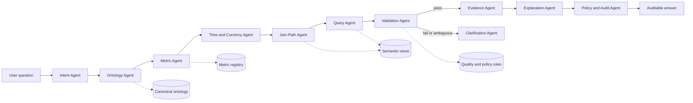
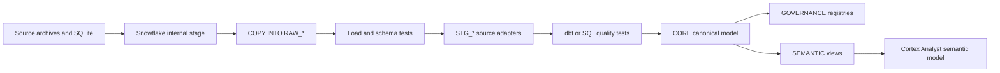

 # Supply Chain Ontology & Governed Conversational Analytics — Problem Definition

## 1. The problem in one sentence

The data is *available* but the **meaning is not agreed**, so three teams can each write technically correct SQL against the same warehouse and produce three different numbers for the same question — and there is no authoritative place that says which one is right.

This is not a data *quality* problem and not a *text-to-SQL accuracy* problem. It is a **semantic governance** problem. Bolting an LLM onto raw tables makes it worse, because the LLM now invents a fourth definition, confidently, at conversational speed.

---

## 2. The landscape (who owns what)

| System | Owner | Grain | What it thinks is "the truth" |
|---|---|---|---|
| **ERP** (SAP/Oracle) | Procurement + Finance | PO line, goods receipt | Commercial commitment, prices, GR posting date |
| **TMS / Logistics** | Logistics | Shipment, container leg | Physical arrival at dock, freight cost |
| **SRM / Supplier Portal** | Supplier Management | Supplier, confirmation | Supplier-confirmed (revised) dates, scorecards |
| **WMS / IoT / Telemetry** | Plant Materials | Bin, sensor event | Physical on-hand, gate-in timestamps |
| **Demand Planning** | Planning | Part × Plant × week | Forecast, consumption, coverage |

Each system has its own key for the same real-world thing, its own date stamp for the same real-world event, and its own cost buckets for the same real-world spend.

---

## 3. Dummy data

### 3.1 Entities (with the identity-resolution problem baked in)

**Supplier** — the same legal entity appears three ways:

| ERP `vendor_id` | ERP name | TMS `carrier_shipper_cd` | Portal name | Finance DUNS |
|---|---|---|---|---|
| SUP-1001 | Acme Fasteners Pte Ltd | VEND-88 | ACME FASTENERS | 55-123-4567 |
| SUP-1044 | Acme Fasteners (Malaysia) | VEND-88 | ACME FASTENERS | 55-123-4567 |
| SUP-1002 | Nordwerk GmbH | NRDW-EU | Nordwerk Gmbh. | 31-987-1122 |
| SUP-1003 | Kaito Components KK | KAI-JP | KAITO COMPONENTS K.K. | 81-444-9090 |

> SUP-1001 and SUP-1044 are **one supplier, two ERP records**. "Top supplier by spend" ranks differently depending on whether you roll up by `vendor_id`, DUNS, or parent company.

**Part**

| part_id | description | commodity | uom | std_cost |
|---|---|---|---|---|
| PRT-A100 | Bracket, steel | Fabrication | EA | 12.00 EUR |
| PRT-B200 | Bearing, sealed | Components | EA | 4.20 USD |
| PRT-C300 | Wire harness | Electrical | EA | 31.50 USD |

**Plant**

| plant_id | name | region | country |
|---|---|---|---|
| PLT-NA-01 | Detroit Assembly | North America | US |
| PLT-EU-02 | Stuttgart Assembly | Europe | DE |

### 3.2 Inbound shipments — Q1 2026 (the core fact table)

Note the **four competing date columns** for one event.

| ship_id | po | supplier | part | plant | qty_ord | qty_rcvd | orig_promise | rev_promise | actual_arrival | gr_posted |
|---|---|---|---|---|---|---|---|---|---|---|
| SHP-001 | PO-5001 | SUP-1001 | PRT-A100 | PLT-NA-01 | 1000 | 1000 | 2026-03-02 | 2026-03-05 | 2026-03-04 | 2026-03-06 |
| SHP-002 | PO-5002 | SUP-1001 | PRT-B200 | PLT-NA-01 | 500 | 480 | 2026-03-10 | 2026-03-10 | 2026-03-10 | 2026-03-10 |
| SHP-003 | PO-5003 | SUP-1002 | PRT-C300 | PLT-EU-02 | 200 | 200 | 2026-03-12 | 2026-03-15 | 2026-03-14 | 2026-03-14 |
| SHP-004 | PO-5004 | SUP-1002 | PRT-A100 | PLT-EU-02 | 800 | 800 | 2026-03-18 | 2026-03-18 | 2026-03-21 | 2026-03-22 |
| SHP-005 | PO-5005 | SUP-1003 | PRT-B200 | PLT-NA-01 | 300 | 300 | 2026-03-20 | 2026-03-20 | 2026-03-19 | 2026-03-19 |
| SHP-006 | PO-5006 | SUP-1003 | PRT-C300 | PLT-NA-01 | 150 | 90 | 2026-03-25 | 2026-03-25 | 2026-03-25 | 2026-03-25 |
| SHP-007 | PO-5007 | SUP-1044 | PRT-A100 | PLT-EU-02 | 600 | 600 | 2026-03-28 | 2026-03-30 | 2026-03-29 | 2026-03-30 |
| SHP-008 | PO-5008 | SUP-1002 | PRT-B200 | PLT-NA-01 | 400 | 400 | 2026-03-30 | 2026-03-30 | 2026-04-02 | 2026-04-02 |
| SHP-009 | PO-5009 | SUP-1003 | PRT-A100 | PLT-NA-01 | 250 | 250 | 2026-03-08 | 2026-03-08 | 2026-03-08 | 2026-03-08 |
| SHP-010 | PO-5010 | SUP-1001 | PRT-C300 | PLT-EU-02 | 100 | 100 | 2026-03-15 | 2026-03-15 | 2026-03-16 | 2026-03-16 |

### 3.3 Outbound customer order lines — Q1 2026

| order | customer | part | qty_ordered | qty_shipped |
|---|---|---|---|---|
| ORD-9001 | CUST-A | PRT-A100 | 100 | 100 |
| ORD-9001 | CUST-A | PRT-B200 | 50 | 30 |
| ORD-9002 | CUST-B | PRT-C300 | 200 | 200 |
| ORD-9003 | CUST-A | PRT-A100 | 80 | 0 |

### 3.4 Inventory & demand snapshot — PRT-A100 @ PLT-NA-01, 2026-03-31

| measure | value |
|---|---|
| On-hand (unrestricted) | 12,000 EA |
| In quality inspection | 1,500 EA |
| In transit | 2,000 EA |
| Trailing 30-day actual consumption | 400 EA/day |
| Forward 90-day forecast demand | 600 EA/day |

### 3.5 Cost components — PO-5004 (800 × PRT-A100, Nordwerk, EUR)

| component | amount (EUR) |
|---|---|
| Material price (800 × €12.00) | 9,600 |
| International freight | 1,400 |
| Duty (4.5% of goods value) | 432 |
| Insurance | 120 |
| Customs brokerage | 200 |
| FX rate at PO date | 1.08 USD/EUR |
| FX rate at receipt date | 1.12 USD/EUR |

---

## 4. The failure demo — one question, many answers

### 4.1 "What was our on-time delivery in Q1?"

**Planning** — arrival vs **original** commit, counted on arrival date, no quantity test:

Late: SHP-001, 003, 004, 007, 010. On time: 002, 005, 006, 009. SHP-008 excluded (arrived in April).

$$\text{OTD}_{\text{planning}} = \frac{4}{9} = \mathbf{44.4\%}$$

**Procurement** — arrival vs **supplier-confirmed revised** date (this is what the scorecard and the rebate clause use):

Late: SHP-004, 010. On time: 001, 002, 003, 005, 006, 007, 009.

$$\text{OTD}_{\text{procurement}} = \frac{7}{9} = \mathbf{77.8\%}$$

**Logistics / Plant Materials** — **OTIF**: goods-receipt posted on/before original promise **and** quantity complete:

Pass: SHP-005, SHP-009. SHP-002 and SHP-006 are on time but short. Rest are late on GR.

$$\text{OTIF}_{\text{logistics}} = \frac{2}{9} = \mathbf{22.2\%}$$

> **44.4% vs 77.8% vs 22.2%.** Same data, same quarter, zero SQL bugs. Three people walk into a steering meeting and the meeting becomes about whose number is right instead of which supplier to fix.

### 4.2 "What's our fill rate?"

- **Line fill** (lines shipped complete): 2 / 4 = **50.0%**
- **Unit fill** (units shipped / units ordered): 330 / 430 = **76.7%**
- **Order fill** (orders shipped 100% complete): 1 / 3 = **33.3%**

### 4.3 "How many days of inventory of PRT-A100 do we have?"

- On-hand ÷ trailing actual consumption: 12,000 ÷ 400 = **30.0 days**
- On-hand ÷ forward forecast: 12,000 ÷ 600 = **20.0 days**
- (On-hand + QI + in-transit) ÷ forward forecast: 15,500 ÷ 600 = **25.8 days**

> One of these says "healthy", one says "reorder now". The difference is entirely a definition choice about *what counts as inventory* and *what counts as demand*.

### 4.4 "What was the landed cost per unit on PO-5004?"

- Price + freight, FX at PO date: (9,600 + 1,400) × 1.08 = $11,880 → **$14.85/unit**
- Full landed (price + freight + duty + insurance + brokerage), FX at receipt: 11,752 × 1.12 = $13,162.24 → **$16.45/unit**

> **10.8% swing** on a sourcing decision. Enough to reverse a make-vs-buy or a regional-sourcing recommendation.

### 4.5 "Who is our largest supplier by spend?"

Rolled up by ERP `vendor_id`, Acme splits into SUP-1001 and SUP-1044 and may not even appear in the top 3. Rolled up by DUNS / parent, Acme is #1. The question isn't even ambiguous to a human — it's ambiguous only because no layer knows those two records are the same company.

---

## 5. Root-cause taxonomy

The five failures above are not five bugs. They are five instances of six structural gaps:

| # | Gap | Evidence from the data |
|---|---|---|
| 1 | **No canonical entity identity** | Acme = SUP-1001 = SUP-1044 = VEND-88 = DUNS 55-123-4567 |
| 2 | **No canonical event definition** | "Delivered" = ship date? arrival? GR posting? gate-in scan? |
| 3 | **No canonical metric formula** | OTD numerator/denominator/tolerance/grain all undeclared |
| 4 | **No canonical hierarchy** | Part→commodity→category; Plant→region→network; Supplier→parent |
| 5 | **No conformed time & currency policy** | Arrival-date vs GR-date period assignment; PO-date vs receipt-date FX |
| 6 | **No governed join path** | Supplier→Part→Plant→Shipment→Order→Customer can be traversed several ways, each producing a different fan-out and double-count |

Gap 6 is the one that silently destroys LLM-generated SQL: an incorrect join between shipments and order lines fans out quantities and inflates every aggregate, and the answer still *looks* plausible.

---

## 6. Why the obvious fixes don't work

| Attempted fix | Why it fails here |
|---|---|
| "Just build a dashboard" | Encodes *one* team's definition in a BI tool. The other two teams build their own dashboards. You now have three governed-looking sources of disagreement. |
| "Just point an LLM at the warehouse" | The LLM must guess which date column, which denominator, which join path. It guesses differently across sessions and phrasings. Non-determinism on top of ambiguity. |
| "Write a data dictionary in Confluence" | Definitions live in prose, disconnected from execution. Nothing enforces that a query obeys them. Drifts within a quarter. |
| "Standardise the source systems" | Multi-year ERP/TMS program, politically blocked, and doesn't survive the next acquisition. |

The gap between the two halves — *documented meaning* and *executed query* — is exactly what a **semantic view / semantic model layer** closes: the definition becomes the executable artifact, and no query can bypass it.

---

## 7. What "solved" looks like — acceptance criteria

The solution is proven when:

1. **Single resolution.** Planning, Procurement, and Logistics each ask "What was our on-time delivery in Q1?" in their own natural phrasing, and all three receive **the same governed number**, with the definition stated in the answer.
2. **Governed divergence, not accidental divergence.** When a persona genuinely needs the variant (`OTIF` vs `OTD_confirmed`), it is an explicitly named, documented metric — not an alternative interpretation of the same words. The system surfaces the alternative rather than silently choosing.
3. **Entity resolution holds.** "Top supplier by spend" returns Acme consolidated, and the answer can show which source records rolled up.
4. **Cross-domain traversal works.** "Which customers are at risk from late deliveries of PRT-A100?" traverses Supplier → Part → Plant → Shipment → Order → Customer with the governed join path and no fan-out double-counting.
5. **Explainability.** Every answer returns: the metric definition, the entities and filters applied, the join path, and the generated SQL — so a controller can audit it.
6. **Ambiguity refusal.** An unmapped or ambiguous question ("what's our supplier health score?") returns a clarification or a "not defined in the ontology" response, not an invented number.
7. **Determinism.** The same question, asked five times and five ways, returns the same number.

---

## 8. Scope boundaries for the build

**In scope:** the 6 core entities (Supplier, Part, Plant, Shipment, Order, Customer) plus Inventory and Cost as facts; 4 canonical metrics (OTD, fill rate, DOI, landed cost); semantic views; NL layer; multi-persona demo.

**Explicitly out of scope:** real ERP connectivity, master-data stewardship workflow, ML forecasting, write-back to source systems.

---

## 9. Decisions to settle before we design

These are the ones that will shape the ontology, so worth agreeing on first:

1. **Which OTD is the enterprise standard**, and which variants get their own governed names? (Recommendation: `otd_original_commit` is the enterprise metric; `otd_confirmed` and `otif` are named, governed siblings.)
2. **Is "delivered" the dock arrival or the GR posting?** — this single choice cascades into DOI, lead time, and supplier scorecards.
3. **Period assignment rule** — event date or posting date? Affects every quarter-boundary shipment like SHP-008.
4. **FX policy** — PO date, receipt date, or month-end rate?
5. **Supplier hierarchy depth** — legal entity, DUNS, or negotiated parent group as the default rollup?
6. **Target platform** — this materially changes the implementation (Snowflake Semantic Views + Cortex Analyst, dbt Semantic Layer + MetricFlow, Databricks Metric Views + Genie, or Power BI semantic model). Worth naming before the design pass.

---

## 10. Next step

Design pass: the ontology model (entities, relationships, hierarchies, metric specs), then the semantic-view encoding. Blocked on decisions 1–3 and 6 above.

## 11. Agent-integrated architecture

The product is not just a chatbot over a warehouse. It is a governed multi-agent analytics workflow. Agents participate at each step, but the ontology, semantic views, metric specifications, and validation policies remain the authority. An agent may propose, classify, validate, explain, or route work; it may not silently redefine a metric or bypass a governed join path.

### 11.1 Agent responsibilities

| Agent | Responsibility | Required output | Must not do |
|---|---|---|---|
| **Intent Agent** | Interpret the user's question, persona, business context, requested period, and entities | Structured question intent | Choose an undefined metric or invent filters |
| **Ontology Agent** | Resolve supplier, part, plant, order, and customer references to canonical entities | Entity-resolution candidates with confidence and source keys | Merge entities without evidence or user-visible policy |
| **Metric Agent** | Map intent to a governed metric and identify legitimate variants | Metric ID, definition, grain, numerator, denominator, and date policy | Create a new formula during query execution |
| **Time and Currency Agent** | Resolve event-date, posting-date, period, UOM, and FX policies | Explicit temporal and currency assumptions | Pick a date or FX rate silently |
| **Join-Path Agent** | Select the approved path across semantic views | Join graph and fan-out safeguards | Join raw facts directly when a governed path exists |
| **Query Agent** | Compile the resolved intent into SQL against semantic views | Read-only SQL and query parameters | Query uncontrolled raw tables or mutate data |
| **Validation Agent** | Test grain, duplicates, nulls, fan-out, reconciliation, and metric invariants | Validation report with pass/fail status | Return a number after a failed validation |
| **Evidence Agent** | Assemble row-level evidence and source lineage for the answer | Supporting records, source systems, and lineage | Hide conflicting source events |
| **Explanation Agent** | Explain the result in the user's language and show governed alternatives | Answer, definition, assumptions, SQL, and evidence | Present an unqualified number without its definition |
| **Policy and Audit Agent** | Enforce access, approved tools, provenance, determinism, and audit logging | Decision log and trace ID | Allow an agent to override policy locally |
| **Clarification Agent** | Ask for missing information when the question is ambiguous or undefined | One or more targeted clarification questions | Guess what the user meant |

### 11.2 End-to-end agent flow



### 11.3 Shared agent contract

Every agent invocation must carry a common execution envelope:

```text
trace_id
conversation_id
user_id
persona
question
ontology_version
metric_registry_version
semantic_view_version
policy_version
input_artifact_ids
output_artifact_ids
confidence
decision_status
reason_codes
```

Agent outputs are typed artifacts rather than free-form text. Examples include `QuestionIntent`, `ResolvedEntity`, `MetricSelection`, `JoinPlan`, `QueryPlan`, `ValidationReport`, `EvidenceBundle`, and `AnswerPackage`. This makes the workflow replayable and allows the system to replace an agent without changing the governed contract.

### 11.4 Agent guardrails

1. **Semantic authority.** Metric definitions, entity hierarchies, date policies, FX policies, and join paths come from versioned registries.
2. **No raw-table escape hatch.** The Query Agent can execute only approved semantic views or approved read-only datasets.
3. **Validation before explanation.** The Explanation Agent cannot publish a result unless the Validation Agent returns `pass`.
4. **Ambiguity is a valid result.** Missing mappings, multiple metric matches, unresolved suppliers, and conflicting dates produce clarification or refusal.
5. **Deterministic replay.** The same question and registry versions must produce the same metric selection, join plan, and result.
6. **Human approval for changes.** Agents may propose ontology, metric, or policy changes, but a governed owner must approve and version them before execution.
7. **Least privilege.** Agents receive only the data and tools needed for their responsibility; none receives write access to source systems.

### 11.5 Acceptance criteria additions

The agent layer is proven when:

8. Every answer includes an agent trace showing intent, entity resolution, metric selection, join path, validation, evidence, and policy decisions.
9. An agent cannot produce a numeric answer when the metric is undefined, entity resolution is ambiguous, or validation fails.
10. Replaying the same question with the same ontology, metric, semantic-view, and policy versions produces the same artifacts and result.
11. Agents can identify a disagreement between source events, such as dock arrival versus GR posting, and present it as governed divergence rather than silently selecting one.
12. A proposed new metric or ontology mapping enters a review queue instead of changing production behavior immediately.

### 11.6 Recommended build order

1. Build the ontology, metric registry, semantic views, and policy registry first.
2. Implement the Intent, Ontology, Metric, and Clarification Agents using typed outputs.
3. Implement the Join-Path and Query Agents with read-only semantic-view access.
4. Add the Validation Agent before adding polished natural-language explanations.
5. Add Evidence, Explanation, and Audit Agents once the result package is stable.
6. Add specialist agents for supplier risk, inventory, landed cost, and customer impact only after the shared contract works.

## 12. Multi-source truth and reconciliation

Integrating data from separate entities does not create a naturally common dataset. Each source is authoritative for a different operational purpose and may describe the same real-world object or event differently. The solution must therefore conform the meaning without erasing source-specific observations.

### 12.1 Source claims, not forced values

The platform preserves source observations as separate claims:

```text
source_system
source_record_id
canonical_entity_id
event_type
observed_value
observed_at
effective_at
source_authority
reconciliation_status
```

For example, an inbound shipment can retain all of these observations:

```text
ERP:  goods_receipt_posted_date = 2026-03-06
TMS:  dock_arrival_date         = 2026-03-04
Portal: revised_promise_date    = 2026-03-05
```

None of these values should be silently overwritten. They represent different events or operational perspectives.

### 12.2 Four integration outcomes

When sources describe the same business concept, the semantic layer must classify the result as one of four outcomes:

1. **Conformed.** The source values represent the same concept and can be combined under a documented rule.
2. **Preferred.** Multiple values exist, but one source is authoritative for a specific use case. The source precedence is recorded.
3. **Reconciled.** Values differ, and a governed transformation derives a comparable value while retaining the inputs.
4. **Divergent.** Values intentionally represent different events, grains, or business perspectives. They remain separate named measures.

For example, `dock_arrival_date` and `goods_receipt_posted_date` are divergent events, not conflicting values that should be merged into a generic `delivery_date`.

### 12.3 Canonical model responsibilities

The canonical model provides:

- Stable cross-source entity identities
- Standard names and data types
- Explicit event types
- Source provenance
- Unit and currency normalization
- Source precedence by business purpose
- Reconciliation and exception status
- Validated relationships between grains

It does not claim that every source has one universally correct value.

### 12.4 Metric execution policy

Every metric must declare which source observation it uses. For example:

```text
otd_original_commit:
	promise_event: original_promise_date
	delivery_event: dock_arrival_date
	quantity_rule: any_quantity_received
	period_rule: dock_arrival_date

otif:
	promise_event: original_promise_date
	delivery_event: goods_receipt_posted_date
	quantity_rule: quantity_received >= quantity_ordered
	period_rule: goods_receipt_posted_date
```

This prevents the system from creating a false common number by mixing an ERP date with a TMS date or by choosing whichever source an agent encounters first.

### 12.5 Reconciliation agent behavior

The Reconciliation Agent should compare source claims and produce a reconciliation record, not overwrite source data:

```text
reconciliation_id
canonical_entity_id
event_type
source_claim_ids
comparison_rule
status
derived_value
variance
explanation
approved_by
```

If no approved rule exists, the agent returns `unreconciled` and routes the case for clarification or governance review. It must not invent a merged value.

### 12.6 Revised acceptance criterion

The solution is proven when separate source entities can contribute different observations about the same business reality, and the system can show:

1. Which source produced each observation.
2. Which canonical concept or event each observation maps to.
3. Whether the observations are conformed, preferred, reconciled, or divergent.
4. Which observation a governed metric uses and why.
5. The original values and any derived value used in the answer.

The final answer is therefore not always one universal value. It is one governed answer for a named business definition, with legitimate alternatives surfaced explicitly when they measure something different.

## 13. Snowflake implementation architecture

Snowflake is the governed data and semantic execution plane for the hackathon. The agent layer may interpret and route a question, but all data access, metric computation, lineage, and audit evidence are executed through Snowflake objects.

### 13.1 Snowflake database and schema layout

Use one Snowflake database with explicit schemas. Keep raw sources separate and expose only curated semantic objects to the conversational layer.

```text
SUPPLY_CHAIN_ONTOLOGY
├── RAW_INVENTORY
├── RAW_PROCUREMENT
├── RAW_OLIST
├── RAW_DATACO
├── RAW_SHIPMENT_PRICING
├── RAW_NIST
├── STG_INVENTORY
├── STG_PROCUREMENT
├── STG_OLIST
├── STG_DATACO
├── STG_SHIPMENT_PRICING
├── STG_NIST
├── CORE
├── GOVERNANCE
├── SEMANTIC
├── AGENT
└── AUDIT
```

Responsibilities:

| Schema | Purpose | Agent access |
|---|---|---|
| `RAW_*` | Immutable source loads with source metadata | No direct access |
| `STG_*` | Source-specific typing, cleanup, and deduplication | No direct access |
| `CORE` | Canonical entities, events, facts, and crosswalks | Read through approved views |
| `GOVERNANCE` | Ontology, metric, policy, and join-path registries | Read-only |
| `SEMANTIC` | Snowflake semantic views and governed answer views | Approved query target |
| `AGENT` | Typed plans, prompts, tool contracts, and run state | Orchestrator only |
| `AUDIT` | Query history, lineage, validation, and decision traces | Append-only |

### 13.2 Ingestion and transformation path

The downloaded ZIP and SQLite sources are loaded into Snowflake stages or tables without changing their source meaning. The same source registry in `DATA_MANIFEST.md` becomes the ingestion control plane.



Recommended loading controls:

```text
source_system
source_file
source_dataset_version
source_row_number
record_hash
ingested_at
load_batch_id
```

Snowflake Tasks and Streams can support incremental processing if the demo evolves beyond the static files. For the initial hackathon build, repeatable batch loads are sufficient and easier to audit.

### 13.3 Core Snowflake objects

The canonical model should include tables or secure views such as:

```text
CORE.SUPPLIER
CORE.SUPPLIER_IDENTIFIER
CORE.PART
CORE.PART_IDENTIFIER
CORE.LOCATION
CORE.CUSTOMER
CORE.PURCHASE_ORDER
CORE.PURCHASE_ORDER_LINE
CORE.SHIPMENT
CORE.SHIPMENT_EVENT
CORE.CUSTOMER_ORDER
CORE.CUSTOMER_ORDER_LINE
CORE.INVENTORY_MOVEMENT
CORE.INVENTORY_POSITION
CORE.COST_OBSERVATION
CORE.SOURCE_CLAIM
```

The governance registry should include:

```text
GOVERNANCE.ONTOLOGY_ENTITY
GOVERNANCE.ENTITY_IDENTIFIER_MAP
GOVERNANCE.METRIC_REGISTRY
GOVERNANCE.METRIC_COMPONENT
GOVERNANCE.JOIN_PATH_REGISTRY
GOVERNANCE.DATE_POLICY
GOVERNANCE.CURRENCY_POLICY
GOVERNANCE.ACCESS_POLICY
GOVERNANCE.ONTOLOGY_VERSION
```

The semantic layer should expose business-oriented views or Snowflake Semantic Views:

```text
SEMANTIC.SUPPLIER_PERFORMANCE
SEMANTIC.INVENTORY_COVERAGE
SEMANTIC.ORDER_FULFILLMENT
SEMANTIC.LANDED_COST
SEMANTIC.CUSTOMER_SUPPLY_RISK
```

Each semantic object must declare its grain, dimensions, measures, relationships, synonyms, and approved join paths. Raw column names must not be the primary vocabulary presented to Cortex Analyst.

### 13.4 Cortex Analyst integration

Cortex Analyst is the natural-language analytics surface over the governed semantic model. It should receive semantic views and metric metadata, not the raw six-source schema.

The request path is:

```text
Streamlit in Snowflake
	-> CoCo or application orchestrator
	-> intent and entity tools
	-> metric registry gate
	-> Cortex Analyst semantic model or approved SQL plan
	-> Snowflake semantic view
	-> validation SQL
	-> answer package
```

The metric gate remains outside free-form generation. Cortex Analyst may translate an approved intent into SQL, but it cannot select an unregistered formula or bypass the semantic view. The application must inspect the generated query before execution and reject queries that reference `RAW_*`, unapproved `CORE` tables, or unregistered joins.

### 13.5 Streamlit in Snowflake experience

The user interface should run as a Streamlit in Snowflake application so the demo stays inside the Snowflake security boundary.

The answer page should show:

```text
Result
Metric ID and definition
Applied period and date policy
Canonical entity and source identifiers
Approved join path
Validation status
Evidence records
Generated SQL
Trace ID and registry versions
```

The UI needs three explicit states:

```text
EXECUTE   governed query ran and validation passed
CLARIFY   required metric, entity, time, or currency input is missing
REFUSE    no governed metric or approved join path exists
```

### 13.6 Snowflake governance and security

Use Snowflake roles and secure views to enforce least privilege:

```text
ROLE_INGEST_SERVICE       -> RAW_* write
ROLE_TRANSFORM_SERVICE    -> STG_* and CORE write
ROLE_GOVERNANCE_STEWARD   -> GOVERNANCE approval
ROLE_AGENT_READ           -> SEMANTIC read, AGENT append, AUDIT append
ROLE_STREAMLIT_APP        -> semantic read and controlled procedure execute
ROLE_AUDITOR              -> audit and lineage read
```

The application role must not have general access to raw tables or write access to source data. Row access policies and masking policies should be added when the source datasets contain user-level or supplier-sensitive information. Query tags should include `trace_id`, `conversation_id`, `persona`, `metric_id`, and `ontology_version` for audit correlation.

### 13.7 Agent-to-Snowflake contract

Agents exchange typed JSON artifacts, while Snowflake stores the durable versions and results.

```text
AGENT.QUESTION_INTENT
AGENT.RESOLVED_ENTITY
AGENT.METRIC_SELECTION
AGENT.JOIN_PLAN
AGENT.QUERY_PLAN
AGENT.VALIDATION_REPORT
AGENT.EVIDENCE_BUNDLE
AGENT.ANSWER_PACKAGE
AUDIT.AGENT_RUN
AUDIT.QUERY_EXECUTION
AUDIT.POLICY_DECISION
```

The Query Agent receives only:

```text
metric_id
canonical_entity_ids
time_range
dimensions
filters
approved_join_path_id
semantic_view_name
```

It does not receive permission to redefine `numerator`, `denominator`, `date_policy`, or `currency_policy`.

### 13.8 Snowflake stored procedures for enforcement

The strongest demo path is to place the final execution gate in a controlled Snowflake procedure or service endpoint:

```text
AGENT.EXECUTE_GOVERNED_QUERY(query_plan_id)
```

The procedure should:

1. Verify the query plan references an active metric registry version.
2. Verify all entities resolved successfully.
3. Verify the join path is approved.
4. Compile or retrieve SQL for the named semantic view.
5. Apply the time, currency, and unit policies from the registry.
6. Run validation queries.
7. Write query, validation, and lineage records to `AUDIT`.
8. Return a result only when validation passes.

This creates a hard control point: an agent cannot obtain a governed number by skipping the orchestration prompt or by issuing a raw-table query from the UI.

### 13.9 Snowflake demo sequence

The hackathon demonstration should show the platform boundary clearly:

1. Load the source files into separate `RAW_*` schemas.
2. Show source-specific fields and row grains.
3. Resolve Acme through `GOVERNANCE.ENTITY_IDENTIFIER_MAP`.
4. Ask the three persona versions of the OTD question.
5. Show all three resolving to the same enterprise metric in `SEMANTIC.SUPPLIER_PERFORMANCE`.
6. Display the generated SQL, query tag, validation result, and source evidence.
7. Ask for “supplier health score” and show the `REFUSE` path.
8. Ask the customer-risk question and show that the approved semantic view prevents fact-to-fact fan-out.

Snowflake is therefore not just the place where the demo data is stored. It is the enforcement boundary for the ontology, metrics, semantic views, security, execution, and audit trail.
